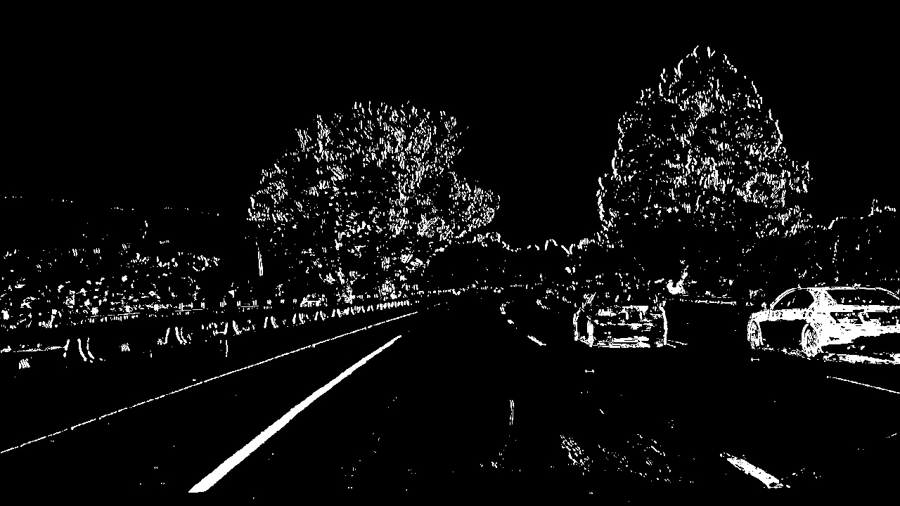
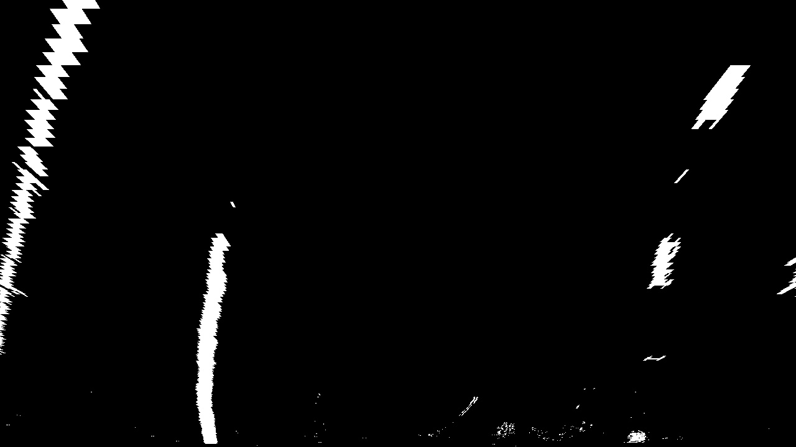
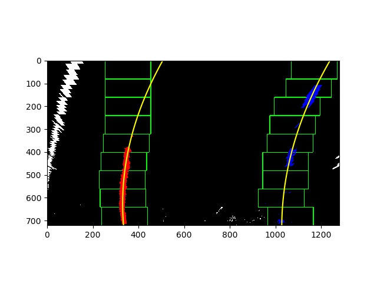
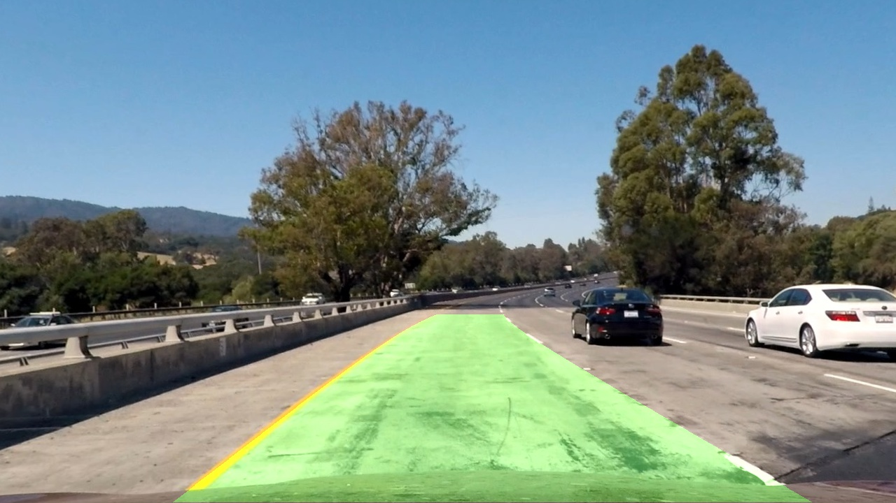

## Advanced Lane Finding

The goals / steps of this project are the following:

* Compute the camera calibration matrix and distortion coefficients given a set of chessboard images.
* Apply a distortion correction to raw images.
* Use color transforms, gradients, etc., to create a thresholded binary image.
* Apply a perspective transform to rectify binary image ("birds-eye view").
* Detect lane pixels and fit to find the lane boundary.
* Determine the curvature of the lane and vehicle position with respect to center.
* Warp the detected lane boundaries back onto the original image.
* Output visual display of the lane boundaries and numerical estimation of lane curvature and vehicle position.

---

### Camera Calibration

#### 1. Briefly state how you computed the camera matrix and distortion coefficients. Provide an example of a distortion corrected calibration image. 

I start by preparing "object points", which will be the (x, y, z) coordinates of the chessboard corners in the world. Here I am assuming the chessboard is fixed on the (x, y) plane at z=0, such that the object points are the same for each calibration image.  Thus, `objp` is just a replicated array of coordinates, and `objpoints` will be appended with a copy of it every time I successfully detect all chessboard corners in a test image.  `imgpoints` will be appended with the (x, y) pixel position of each of the corners in the image plane with each successful chessboard detection.  

I then used the output `objpoints` and `imgpoints` to compute the camera calibration and distortion coefficients using the `cv2.calibrateCamera()` function.  I applied this distortion correction to the test image using the `cv2.undistort()` function and obtained this result: 


### Pipeline (single images)

#### 1. An example of a distortion-corrected image.

To demonstrate this step, I will describe how I apply the distortion correction to one of the test images like this one:


#### 2. Describe how you used color transforms, gradients or other methods to create a thresholded binary image.  Provide an example of a binary image result.

I used a combination of color(HLS S Channel) and gradient(X, Y direction Sobel, magnitude and direction togther) thresholds to generate a binary image.  Here's an example of my output for this step.  



#### 3. Describe how (and identify where in your code) you performed a perspective transform and provide an example of a transformed image.

The code for my perspective transform includes a function called `warper()`, which appears in the file `warp.py`.  The `warper()` function takes as inputs an image (`img`), as well as source (`src`) and destination (`dst`) points.  I chose the hardcode the source and destination points in the following manner:

```python
        src = np.float32([[200, 720], [1100, 720], [595, 450], [685, 450]])
        dst = np.float32([[300, 720], [980, 720], [300, 0], [980, 0]])
```

I verified that my perspective transform was working as expected by drawing the `src` and `dst` points onto a test image and its warped counterpart to verify that the lines appear parallel in the warped image.



#### 4. Describe how you identified lane-line pixels and fit their positions with a polynomial?

Then I did some other stuff and fit my lane lines with a 2nd order polynomial kinda like this, the code are in the `search.py`:



#### 5. Describe how you calculated the radius of curvature of the lane and the position of the vehicle with respect to center.

I did this in `curvanture.py`.

For the calculation of vehicle offset, I just calculate the center of the left and right curvature compare withe center of the whole image.

#### 6. Provide an example image of your result plotted back down onto the road such that the lane area is identified clearly.

I implemented the function called `process()` in `main.py`.  Here is an example of my result on a test image:



---

### Pipeline (video)

#### 1. The final video output.
[](https://www.youtube.com/watch?v=yl1CSXA0v88)

[youtube link](https://www.youtube.com/watch?v=yl1CSXA0v88&feature=youtu.be)

---

### TODOs
Improve the Line class to store more information.

---

### Discussion

#### 1. Briefly discuss any problems / issues you faced in your implementation of this project.  Where will your pipeline likely fail?  What could you do to make it more robust?

The problem I faced is when the road has light condition changes(from bright color to shadow dark color) the result become worse. It cannot find the left and right fit line for the image. Also, it seems for the binary threshold part, you should carefully choose what kinds of threshold you would like to use. The more threshold doesnt mean better result.
