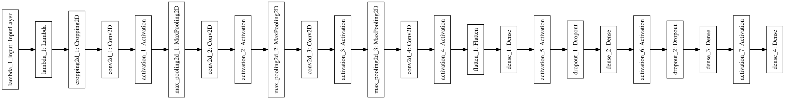
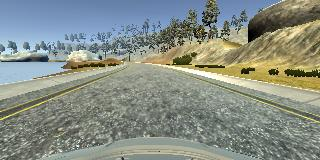
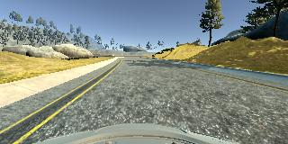
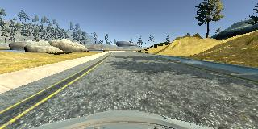
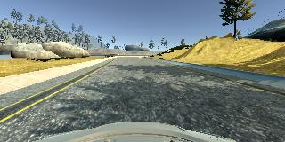
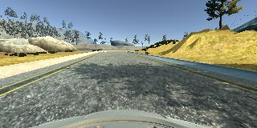
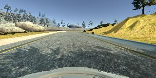

#**Behavioral Cloning** 

The goals / steps of this project are the following:
* Use the simulator to collect data of good driving behavior
* Build, a convolution neural network in Keras that predicts steering angles from images
* Train and validate the model with a training and validation set
* Test that the model successfully drives around track one without leaving the road
* Summarize the results with a written report

###Files Submitted & Code Quality

####1. Submission includes all required files and can be used to run the simulator in autonomous mode

My project includes the following files:

* model.py containing the script to create and train the model
* drive.py for driving the car in autonomous mode
* nvidianet.h5 containing a trained convolution neural network 
* report.pdf summarizing the results

####2. Submission includes functional code
Using the Udacity provided simulator and my drive.py file, the car can be driven autonomously around the track by executing 
```
python drive.py nvidianet.h5
```

and then open the simulator

####3. Submission code is usable and readable

The model.py file contains the code for training and saving two different convolution neural network for behavioral cloning. The file shows the pipeline I used for training and validating the model, and it contains comments to explain how the code works.

###Model Architecture and Training Strategy

####1. An appropriate model architecture has been employed

During this project, I implemented two different kinds of nerual network for behavioral cloning, the first one is a simplified VGG16 which I removed some convolution layers. To reduce total amount of weights and training time. The second one is designed from the orginal Nvidia CNN in the lecture. The only difference is Dropout layers were added.

The model including a Lambda layer and a Cropping2D layer for data preprossing, normalizing and cropping image. And the model includes RELU layers to introduce nonlinearity, and also, Dropout layers for reducing overfitting.

####2. Attempts to reduce overfitting in the model

* The model contains dropout layers in order to reduce overfitting.
* The input data was collected through different kinds of driving behavior, and use left, right, center cameras together for training.
* The model was trained and validated on different data sets to ensure that the model was not overfitting.
* The model was tested by running it through the simulator and ensuring that the vehicle could stay on the track.

####3. Model parameter tuning

The model used an adam optimizer, so the learning rate was not tuned manually.

####4. Appropriate training data

Training data was chosen to keep the vehicle driving on the road. I used a combination of center lane driving for 2 laps, recovering from the left and right sides of the road for 1 lap, and reverse direction center lane driving for 1 lap.

For details about how I created the training data, see the next section. 

###Model Architecture and Training Strategy

####1. Solution Design Approach

The overall strategy for deriving a model architecture was to fine tune existed neural network architecture.

My first step was to use a convolution neural network model similar to the VGG16. I thought this model might be appropriate because it already shows great performance in image classification and detection area, however, the orginal architecture was really deep and complex. So I removed some layers for the previous architecture, the result from this design is good but not perfect, it's not quite keeping center, but close to right lane.

Then I implement the nvidia design architecture, and add dropout layers to avoid overfitting, the results was better.

For both architecture mentioned above the training error and validation error are both pretty low. However, somehow I think the training and validation dataset size is not big, and similar data, it would have some overfitting problem, but this is for a bigger aspect for the neural network, it's working well for the lake track but not that good for the jungle track.

At first, I only used the center camera image, by this way, the car can keep in the center, but once it can not head into right direction when turning left or right, it can never come back to right track. To avoid this drawbacks, I used left and right camera image together for training.

To combat the overfitting, I modified the model so that ...

Then I ... 

The final step was to run the simulator to see how well the car was driving around track one. There were a few spots where the vehicle fell off the track... to improve the driving behavior in these cases, I ....

At the end of the process, the vehicle is able to drive autonomously around the track without leaving the road.

####2. Final Model Architecture

Here is a visualization of the nvidianet architecture , it shows the layers and layers sThe final model architecture consisted of a convolution neural network with the following layers and layer sizes 

The Layers are the following size:

* Conv_1: 5x5x24
* Conv_2: 5x5x36
* Conv_3: 5x5x48
* Conv_5: 3x3x64
* FC_1: 100
* FC_2: 50
* FC_3: 10
* MaxPool2D: 2x2



####3. Creation of the Training Set & Training Process

To capture good driving behavior, firstly I recorded two laps on track one using center lane driving. Here is an example image of center lane driving:



I then recorded the vehicle recovering from the left side and right sides of the road back to center so that the vehicle would learn how to go back center if it is heading the wrong direction. These images show what a recovery looks like starting from:







Then I repeated this process on track two in order to get more data points.

To augment the data sat, I also flipped images and angles thinking that this would add more data for training. After the collection process, I hadover 16k data images for traning. I then preprocessed this data by normalization, set the values into 0.0 - 1.0. Also, I did a crop on images to reduce environment extra negative influence

I finally randomly shuffled the data set and put 20% of the data into a validation set. 

I used this training data for training the model. The validation set helped determine if the model was over or under fitting. The ideal number of epochs was 10 as evidenced by my experiments I used an adam optimizer so that manually training the learning rate wasn't necessary.
