## Vehicle Detection Project**

The goals / steps of this project are the following:

* Perform a Histogram of Oriented Gradients (HOG) feature extraction on a labeled training set of images and train a classifier Linear SVM classifier
* Optionally, you can also apply a color transform and append binned color features, as well as histograms of color, to your HOG feature vector. 
* Note: for those first two steps don't forget to normalize your features and randomize a selection for training and testing.
* Implement a sliding-window technique and use your trained classifier to search for vehicles in images.
* Run your pipeline on a video stream (start with the test_video.mp4 and later implement on full project_video.mp4) and create a heat map of recurring detections frame by frame to reject outliers and follow detected vehicles.
* Estimate a bounding box for vehicles detected.

[//]: # (Image References)
[image1]: ./example_images/vehicle.png
[image_1]: ./example_images/non_vehicle.png
[image2]: ./example_images/vehicle_hog.png
[image_2]: ./example_images/non_vehicle_hog.png
[image3]: ./examples/sliding_windows.jpg
[image4]: ./examples/sliding_window.jpg
[image5]: ./examples/bboxes_and_heat.png
[image6]: ./examples/labels_map.png
[image7]: ./examples/output_bboxes.png
[video1]: ./project_video.mp4

## [Rubric](https://review.udacity.com/#!/rubrics/513/view) Points
###Here I will consider the rubric points individually and describe how I addressed each point in my implementation.  

---
###Writeup / README

####1. Provide a Writeup / README that includes all the rubric points and how you addressed each one.  

You're reading it!

###Histogram of Oriented Gradients (HOG)

####1. Explain how (and identify where in your code) you extracted HOG features from the training images.

The code for this step is contained in the file called `feature.py`.  

I started by reading in all the `vehicle` and `non-vehicle` images.  Here is an example of one of each of the `vehicle` and `non-vehicle` classes:

![alt text][image1]
![alt text][image_1]

I then explored different color spaces and different `skimage.hog()` parameters (`orientations`, `pixels_per_cell`, and `cells_per_block`).  I grabbed random images from each of the two classes and displayed them to get a feel for what the `skimage.hog()` output looks like.

Here is an example using the `RGB` color space and HOG parameters of `orientations=30`, `pixels_per_cell=(16, 16)` and `cells_per_block=(2, 2)`:

![alt text][image2]
![alt text][image_2]

####2. Explain how you settled on your final choice of HOG parameters.

I tried various combinations of parameters and made my final choices like the below:
`color_space = 'RGB'`

`orient = 30  `

`pix_per_cell = 16` 

`cell_per_block = 2` 

`hog_channel = 'ALL'` 

`spatial_size = (16, 16)` 

`hist_bins = 16	`

`bin_f= False `

`color_f = False` 

`hog_f = True`

as what I used in the `main.py`

####3. Describe how (and identify where in your code) you trained a classifier using your selected HOG features (and color features if you used them).

I trained a linear SVM using the HOG feature with parameters I mentioned above, here I didnt use the color and bin feature, because from what I tried, I found they might not be so helpful under this situation, you can find the code in the `svm.py`

Also, the car and not car data sample, I use the radio as 1:2, bacause of I got alot false positive result at first, but after change this, the problem get fixed.

I normalize the features by using scikit-learn's StandardScaler and use the train_test-split of 90:10.

###Sliding Window Search

####1. Describe how (and identify where in your code) you implemented a sliding window search.  How did you decide what scales to search and how much to overlap windows?

I implemented a basic sliding window search to detect areas in the image where a vehicle is likely present, the idea was fromt the section, just detect the below half of the frame. A window size of 96x96 pixels worked well for the scale of vehicles present in the project video, so I only used this window size for this project. 

---

### Video Implementation

####1. Provide a link to your final video output.  Your pipeline should perform reasonably well on the entire project video (somewhat wobbly or unstable bounding boxes are ok as long as you are identifying the vehicles most of the time with minimal false positives.)
Here's the link https://youtu.be/wQGJwtPWkvI

####2. Describe how (and identify where in your code) you implemented some kind of filter for false positives and some method for combining overlapping bounding boxes.

I recorded the positions of positive detections in each frame of the video.  From the positive detections I created a heatmap and then thresholded that map to identify vehicle positions.  I then used `scipy.ndimage.measurements.label()` to identify individual blobs in the heatmap.  I then assumed each blob corresponded to a vehicle.  I constructed bounding boxes to cover the area of each blob detected.  

Here's an example result showing the heatmap from a series of frames of video, the result of `scipy.ndimage.measurements.label()` and the bounding boxes then overlaid on the last frame of video:

### Here are six frames and their bounding boxes:

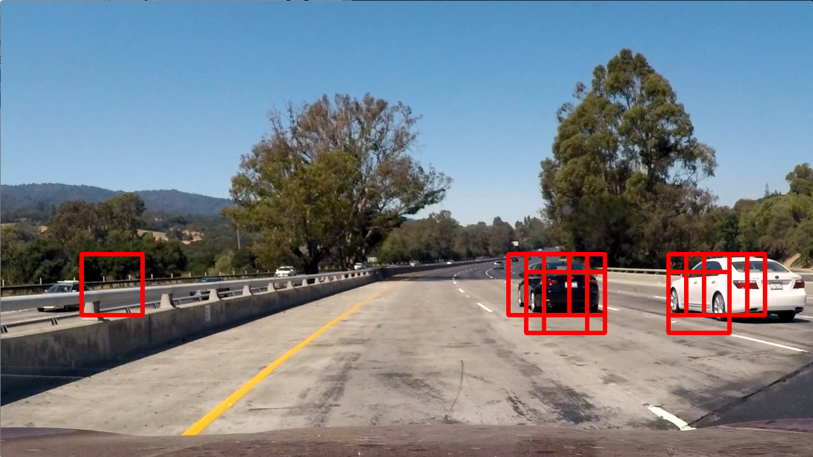
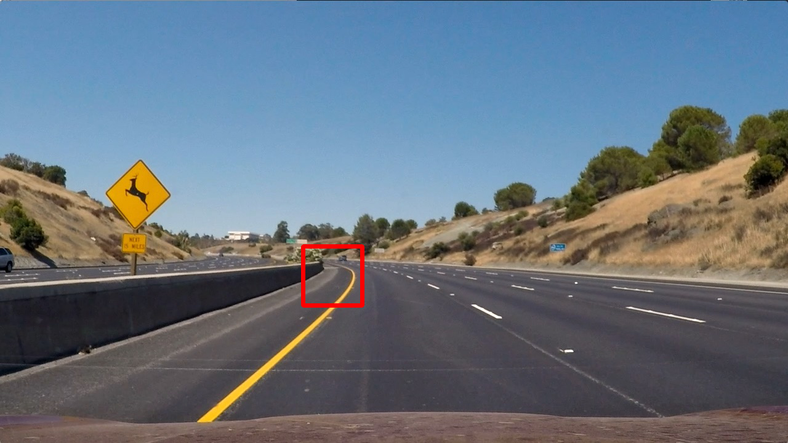
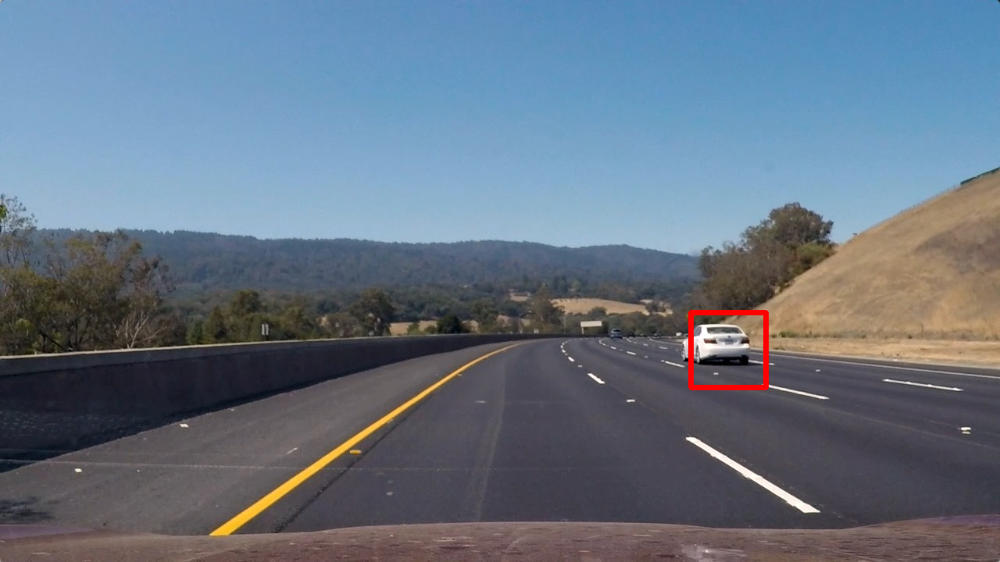
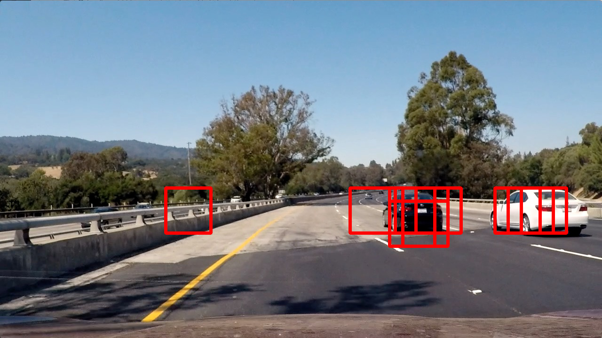
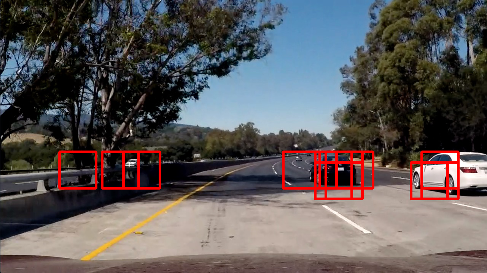
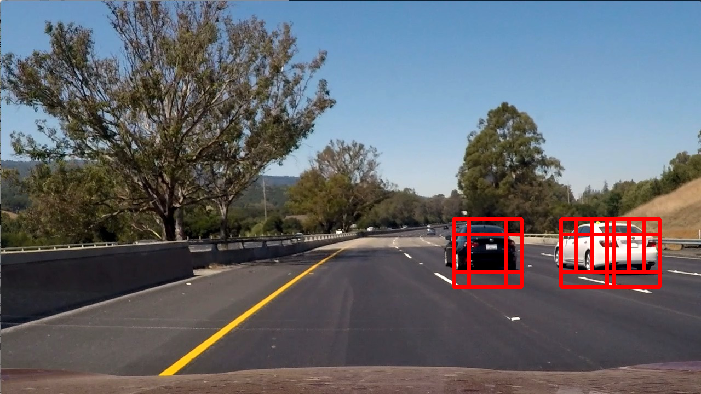

### Here is the output of `scipy.ndimage.measurements.label()` on the integrated heatmap from all six frames:

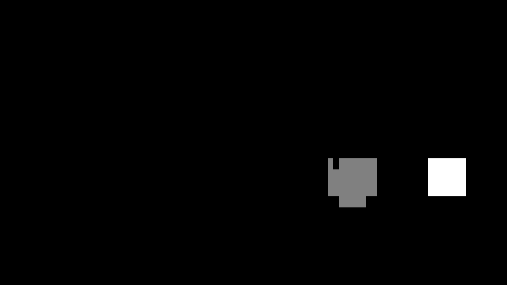
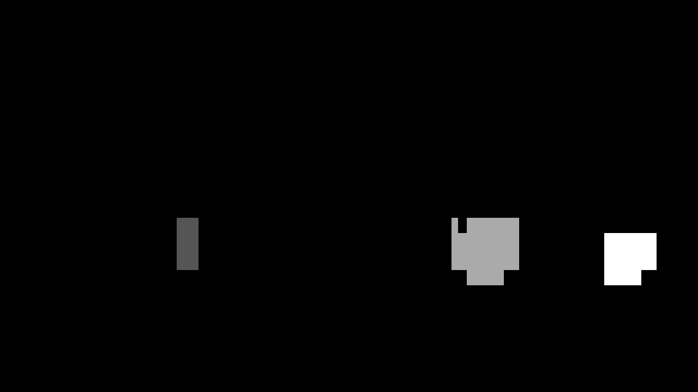

### Here the resulting bounding boxes are drawn onto the last frame in the series:
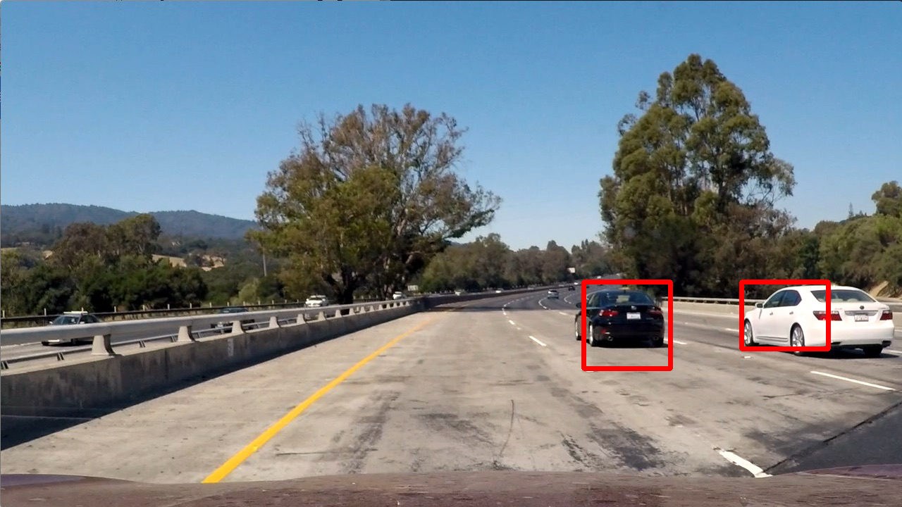

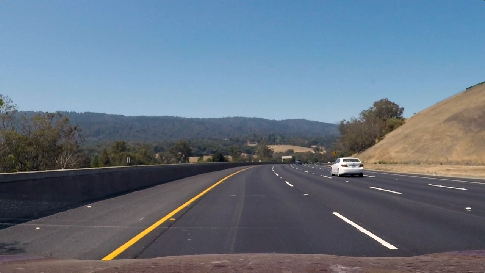
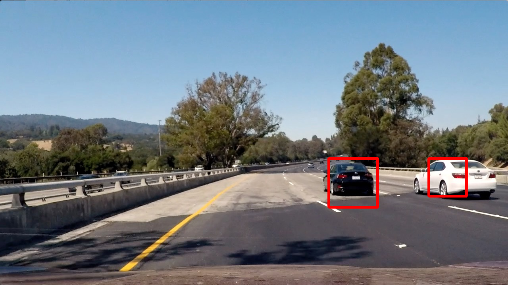
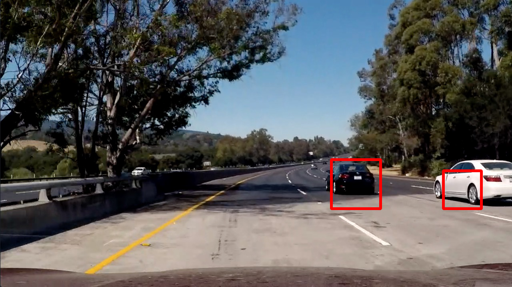
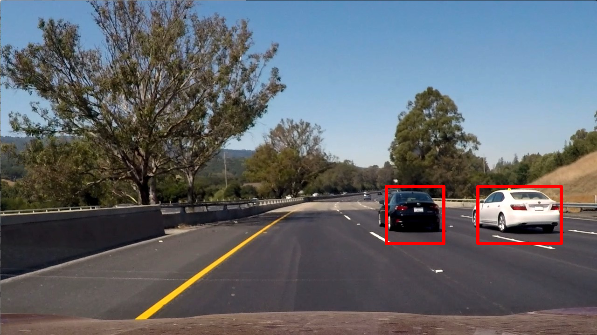

---

###Discussion

####1. Briefly discuss any problems / issues you faced in your implementation of this project.  Where will your pipeline likely fail?  What could you do to make it more robust?

I did the project as the section mentioned, but I think Im really curious about how to do in a deep learning way, maybe using yolo or ssd to make the whole pipeline working.

